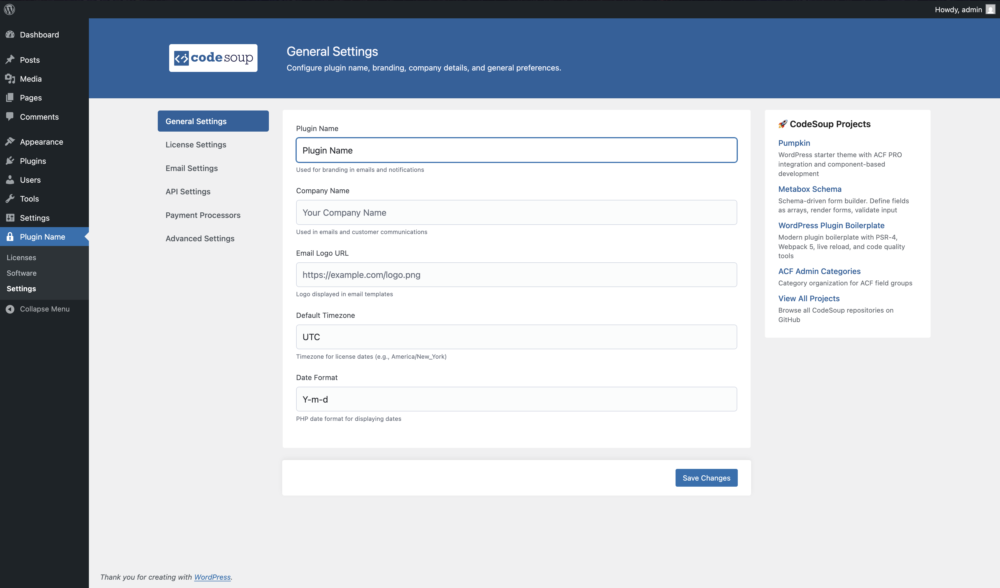

# CodeSoup Options

**Version 1.1.0** - WordPress options manager using custom post types with built-in ACF integration.

Manage WordPress options using custom post types instead of the wp_options table. Includes built-in Advanced Custom Fields integration and can be extended to use with any field framework (CMB2, MetaBox.io, Carbon Fields) or native metaboxes.



## Features

- **Tabbed UI** - Organize options in tabs with horizontal or vertical layouts
- **Revision History** - Track changes over time
- **Post Locking** - Prevent concurrent edits
- **Better Organization** - Multiple option pages with capability control
- **Built-in ACF Integration** - Works out of the box with Advanced Custom Fields
- **CodeSoup Metabox Schema** - Designed to work with [CodeSoup Metabox Schema](https://github.com/code-soup/metabox-schema) for declarative form generation
- **Extensible** - Can be extended to use with CMB2, MetaBox.io, Carbon Fields, or native metaboxes
- **Two UI Modes** - Choose between traditional pages mode or tabbed interface

## Requirements

- PHP >= 7.4
- WordPress >= 6.0
- Optional: ACF, CMB2, MetaBox.io, or Carbon Fields

## Installation

### Via Composer

```bash
composer require codesoup/options
```

### As WordPress Plugin

1. Download and extract to `wp-content/plugins/codesoup-options`
2. Activate the plugin
3. Add configuration to your theme or plugin

## Quick Start

### Native Metaboxes (No Framework)

```php
use CodeSoup\Options\Manager;

$manager = Manager::create(
	'site_settings',
	array(
		'menu_label'   => 'Site Settings',
		'integrations' => array(
			'acf' => array( 'enabled' => false ),
		),
	)
);

$manager->register_page(
	array(
		'id'         => 'general',
		'title'      => 'General Settings',
		'capability' => 'manage_options',
	)
);

$manager->register_metabox(
	array(
		'page'  => 'general',
		'title' => 'Site Information',
		'path'  => __DIR__ . '/templates/site-info.php',
		'class' => 'site-info-metabox',
	)
);

$manager->init();

// Retrieve options
$options = Manager::get( 'site_settings' )->get_options( 'general' );
```

**Note:** You must create your own HTML fields in the template and implement a save handler using `Manager::save_options()`. See **[Native Metaboxes](docs/native.md)** for details.

### With ACF (Default)

```php
use CodeSoup\Options\Manager;

$manager = Manager::create( 'theme_settings' );

$manager->register_page(
	array(
		'id'          => 'general',
		'title'       => 'General',
		'capability'  => 'manage_options',
		'description' => 'General site settings and configuration',
	)
);

$manager->init();

// Retrieve options
$logo = Manager::get( 'theme_settings' )->get_option( 'general', 'site_logo' );
```

**Note:** Create ACF field groups and assign them using the "CodeSoup Options" location rule (select your page ID, e.g., "general"). ACF handles saving automatically - no save_post hook needed. See **[ACF Integration](docs/acf.md)** for details.

## Documentation

- **[Examples](docs/examples/)** - Working code examples
- **[Tabbed UI](docs/tabbed-ui.md)** - Modern tabbed interface
- **[Native Metaboxes](docs/native.md)** - Using without any framework
- **[ACF Integration](docs/acf.md)** - Using with Advanced Custom Fields
- **[Custom Integrations](docs/custom-integrations.md)** - CMB2, MetaBox.io, Carbon Fields
- **[API Reference](docs/api.md)** - Complete method documentation
- **[Migration Guide](docs/migration.md)** - Migrating post_type, prefix, and capabilities

## Agent Skills

AI-optimized documentation for agents is available in the `skills/` directory. See **[skills/README.md](skills/README.md)** for installation and usage.

## Configuration

```php
Manager::create(
	'instance_key',
	array(
		// Core settings
		'post_type'      => 'custom_options',
		'prefix'         => 'custom_',
		'revisions'      => true,
		'cache_duration' => HOUR_IN_SECONDS,
		'debug'          => false,

		// Menu configuration
		'menu'           => array(
			'label'    => 'Settings',
			'icon'     => 'dashicons-admin-settings',
			'position' => 50,
			'parent'   => null,
		),

		// UI configuration
		'ui'             => array(
			'mode'          => 'pages',  // 'pages' or 'tabs' (see docs/tabbed-ui.md)
			'tab_position'  => 'top',    // 'top' or 'left' (tabs mode only)
			'templates_dir' => null,     // Custom templates directory path
		),

		// Assets configuration
		'assets'         => array(
			'disable_styles'  => false,  // Disable plugin styles
			'disable_scripts' => false,  // Disable plugin scripts
			'disable_branding' => false, // Disable CodeSoup branding header
		),

		// Integrations
		'integrations'   => array(
			'acf' => array(
				'enabled' => true,
				'class'   => 'CodeSoup\\Options\\Integrations\\ACF\\Init',
			),
		),
	)
);
```

**Note:** The old flat configuration structure triggers deprecation warnings. See [Migration Guide](docs/migration-v1.1.md) to upgrade.

## License

GPL-3.0+

## Support

- **Issues:** [GitHub Issues](https://github.com/codesoup/options/issues)
- **Website:** [codesoup.co](https://www.codesoup.co)
