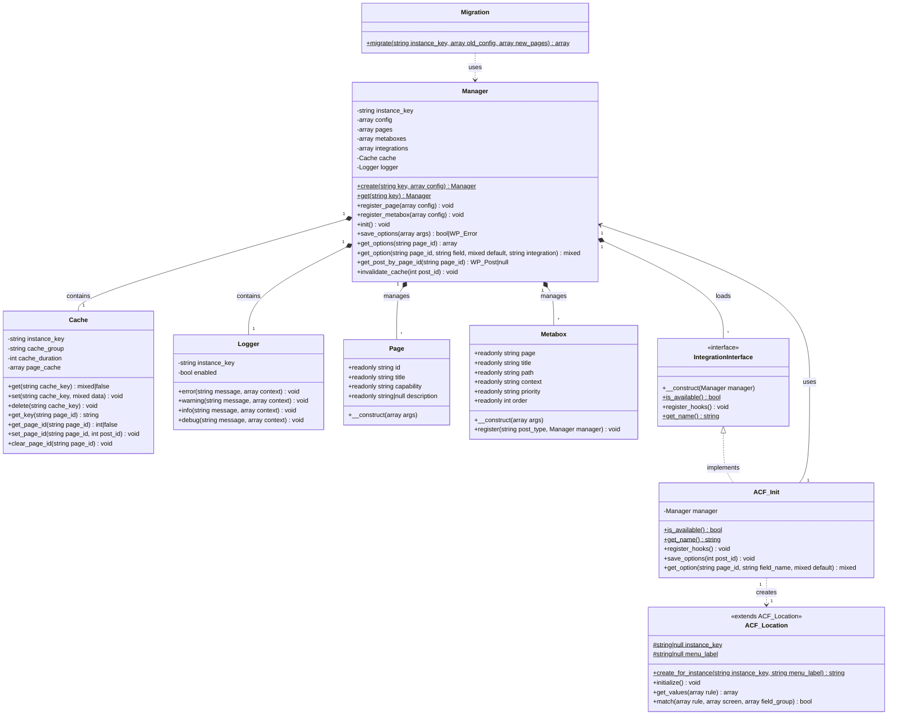

# Architecture Overview

This document provides a visual overview of the CodeSoup Options package architecture.

## Class Diagram



## Component Relationships

### Core Components

**Manager** (Central Hub)
- Singleton registry pattern - one instance per configuration key
- Orchestrates all other components
- Handles WordPress hooks and admin UI
- Manages pages, metaboxes, and integrations

**Cache** (Performance Layer)
- Multi-layer caching: instance → object cache → transient
- Namespaced by instance key
- Handles cache invalidation

**Logger** (Debugging & Monitoring)
- Centralized logging for all operations
- Namespaced by instance key
- Respects WP_DEBUG settings

### Value Objects

**Page** (Immutable Configuration)
- Represents an options page
- Readonly properties (PHP 8.1+)
- Validates required fields on construction

**Metabox** (Immutable Configuration)
- Represents a custom metabox
- Readonly properties (PHP 8.1+)
- Handles template rendering

### Integration System

**IntegrationInterface** (Contract)
- Defines integration requirements
- All integrations must implement this
- Enables framework-agnostic design

**ACF_Init** (ACF Integration)
- Implements IntegrationInterface
- Handles ACF-specific hooks
- Manages data synchronization between ACF meta and post_content

**ACF_Location** (ACF Location Rule)
- Extends ACF's base Location class
- Dynamically created per Manager instance
- Enables ACF field group assignment

### Utility Classes

**Migration** (Data Migration)
- Static utility class
- Handles post_type and prefix changes
- Syncs capabilities from code to database

## Data Flow

### Saving Data (Native Metaboxes)

```
User Input → save_post Hook → Manager::save_options()
    ↓
Nonce Verification
    ↓
Data Serialization (maybe_serialize)
    ↓
wp_update_post (post_content)
    ↓
Cache Invalidation
```

### Saving Data (ACF Integration)

```
User Input → ACF Processing → acf/save_post Hook
    ↓
ACF saves to postmeta
    ↓
ACF_Init::save_options()
    ↓
get_fields() from ACF
    ↓
Serialize and save to post_content
    ↓
Cache Invalidation
```

### Retrieving Data

```
Manager::get_options(page_id)
    ↓
Check Cache (instance → object → transient)
    ↓
Cache Hit? → Return cached data
    ↓
Cache Miss? → get_post_by_page_id()
    ↓
Unserialize post_content
    ↓
Cache result
    ↓
Return data
```

## WordPress Integration Points

### Hooks Used

**Actions:**
- `init` - Register custom post type
- `current_screen` - Ensure pages exist
- `admin_menu` - Register admin menu
- `admin_notices` - Show creation errors
- `add_meta_boxes` - Register metaboxes
- `before_delete_post` - Invalidate cache
- `wp_trash_post` - Invalidate cache
- `acf/save_post` - ACF data synchronization (ACF integration only)
- `acf/init` - Register ACF location type (ACF integration only)

**Filters:**
- `pre_get_posts` - Filter by capability
- `views_edit-{post_type}` - Remove views
- `manage_{post_type}_posts_columns` - Remove date column

### Custom Post Type

Each Manager instance registers a custom post type with:
- Configurable post_type name
- Hidden from public queries
- Supports revisions (optional)
- No UI (managed through custom admin pages)

### Caching Strategy

**Three-layer cache:**
1. **Instance cache** - PHP array, per-request
2. **Object cache** - WordPress object cache (persistent if memcached/Redis available)
3. **Transient** - Database-backed, cross-request fallback

**Cache keys:**
- Options: `cs_opt_{instance_key}_{page_id}`
- Post IDs: `cs_opt_{instance_key}_post_id_{page_id}`
- Accessible posts: `cs_opt_{instance_key}_accessible_posts_{capability_hash}`

## Design Patterns

**Singleton Registry** - Manager instances stored in static array

**Value Object** - Page and Metabox are immutable data containers

**Strategy Pattern** - IntegrationInterface allows swappable field frameworks

**Factory Pattern** - ACF_Location::create_for_instance() creates dynamic classes

**Dependency Injection** - Integrations receive Manager instance in constructor

## Security Considerations

**CSRF Protection** - Nonce verification in save_options()

**Capability Checks** - Per-page capability enforcement

**Input Sanitization** - All user input sanitized (developer responsibility for save_options data)

**Output Escaping** - All output escaped in templates

**SQL Injection Prevention** - Uses WordPress prepared statements

**Object Injection Prevention** - Uses maybe_serialize/maybe_unserialize

